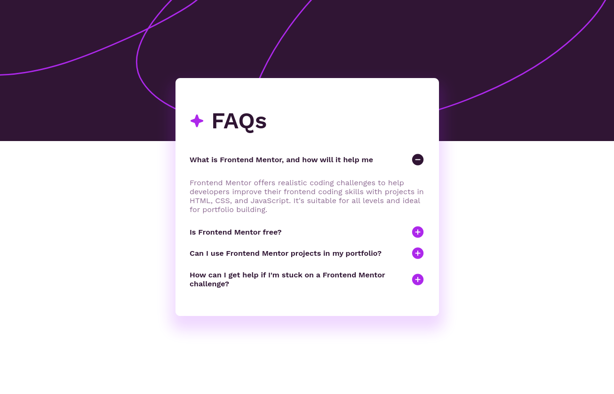

# Frontend Mentor - FAQ accordion solution

This is a solution to the [FAQ accordion challenge on Frontend Mentor](https://www.frontendmentor.io/challenges/faq-accordion-wyfFdeBwBz). Frontend Mentor challenges help you improve your coding skills by building realistic projects. 

## Table of contents

- [Overview](#overview)
  - [The challenge](#the-challenge)
  - [Screenshot](#screenshot)
  - [Links](#links)
- [My process](#my-process)
  - [Built with](#built-with)
  - [What I learned](#what-i-learned)
  - [Continued development](#continued-development)
  - [Useful resources](#useful-resources)
- [Author](#author)

## Overview

### The challenge

Users should be able to:

- Hide/Show the answer to a question when the question is clicked
- Navigate the questions and hide/show answers using keyboard navigation alone
- View the optimal layout for the interface depending on their device's screen size
- See hover and focus states for all interactive elements on the page

### Screenshot



### Links

- Solution URL: [solution](https://github.com/OGR-67/frontend-mentor/tree/FAQ_accordion)
- Live Site URL: [live site](http://www.olivier-roos.dev/frontend-mentor/public/index.html)

## My process

### Built with

- Semantic HTML5 markup
- sass
- Flexbox

### What I learned

The `margin` property is incompatible with centring using the method:

```css
.container {
  position: absolute;
  top: 50%;
  left: 50%;
  transform: translate(-50%, -50%)
}
```

Using `margin` in this case cause the container to not be exactly centered.

### Continued development

Even if this is totaly overkill, I'll try to redo this challenge in React so I can re-implement the javascript logic using states.

### Useful resources

- [MDN javascript](https://developer.mozilla.org/fr/docs/Web/javascript) - You've never read enough of documentation
- [MDN css](https://developer.mozilla.org/fr/docs/Web/css) - You've never read enough of documentation

## Author

- Website - [Olivier ROOS](https://www.olivier-roos.dev)
- Frontend Mentor - [@OGR-67](https://www.frontendmentor.io/profile/OGR-67)
- LinkedIn - [@olivier-roos](https://www.linkedin.com/in/olivier-roos)
